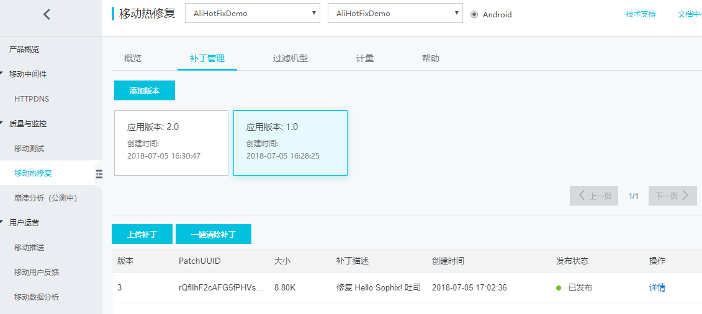
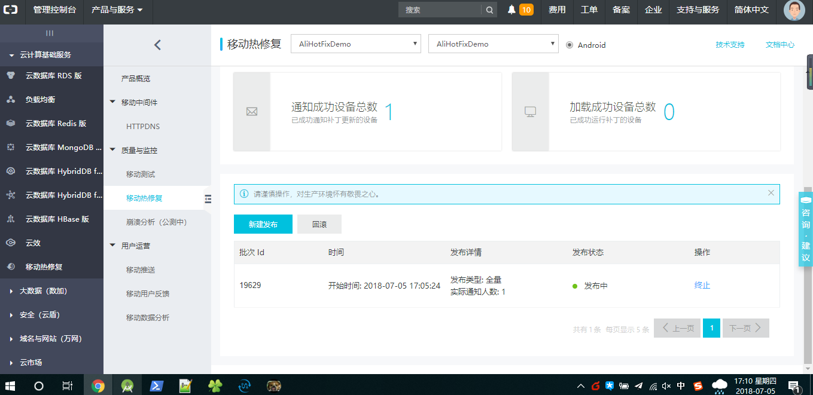

# 阿里 Sophix 热修复

文档中心 [地址](https://help.aliyun.com/document_detail/69874.html?spm=a2c4g.11186623.6.552.IYLNUd#1.2%20%E9%9B%86%E6%88%90%E5%87%86%E5%A4%87)

控制台 [地址](https://emas.console.aliyun.com/#/product/3560919/overview)

`doc` 目录下 `app-release1.apk` 是原版，`app-release2.apk` 是修复版，`sophix-patch.jar` 是补丁包

**注意**：修复版版本号记得要大于旧版本

补丁包添加：

修复成功：

可参考：https://www.jianshu.com/p/8ea4d653a53e
