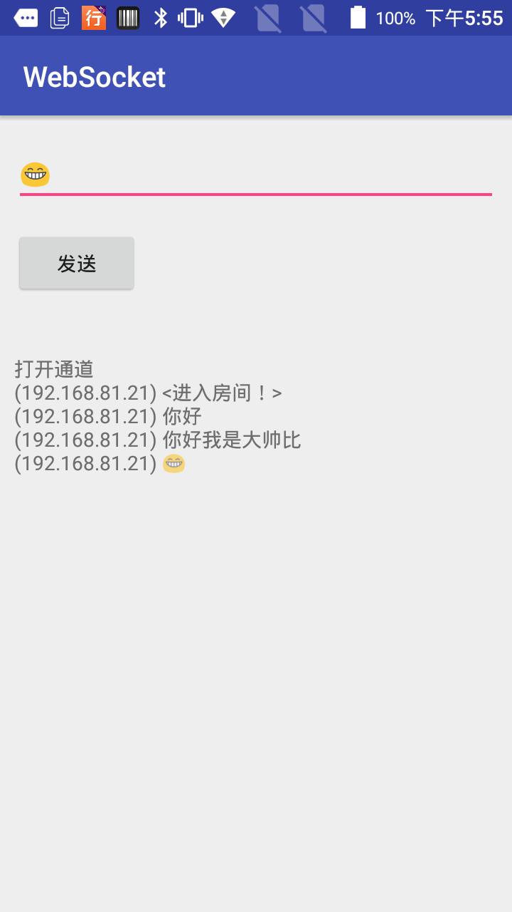

## Websocket 测试

1,客户端
    WebSocketActivity 聊天页面

2.服务端：
    运行 `WebSocketMainMethod` 的 main，等待客户端连接

注意：本 demo 需要先运行服务端， 然后打开客户端app，再连接，目前没有做心跳重连

### websocket 的框架选择：
1. java-webSocket(本文使用的), GitHub 地址：https://github.com/TooTallNate/Java-WebSocket
2. autobahn, http://autobahn.ws/android/
3. AndroidAsyn, GitHub 地址：https://github.com/koush/AndroidAsync
4. Netty, http://netty.io/

